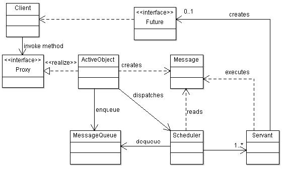
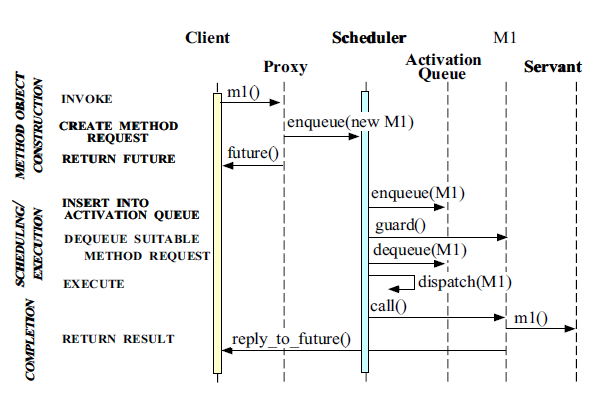
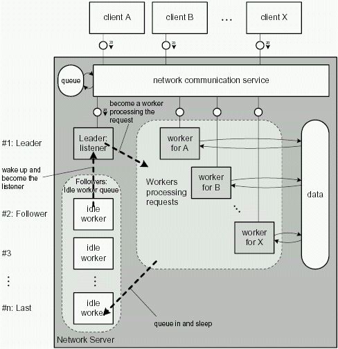

# 并发模式

### 并发模式简介

并发体系结构的选择对多线程网络中间件和应用程序的设计和性能具有重大影响。没有单一的并发体系结构适合所有工作负载条件以及硬件和软件平台。不同的并发模式为不同的并发问题提供了解决方案，[并发模式](https://en.wikipedia.org/wiki/Concurrency_pattern)是用来处理多线程编程范式的设计模式。

多线程设计模式是前人解决并发问题的经验总结，当我们试图解决一个并发问题时，首选方案往往是使用匹配的设计模式，这样能避免走弯路; 使用设计模式还能提升方案和代码的可理解性。

常见的并发模式有：

* Immutability 模式
* Copy-on-Write 模式
* Thread-Specific Storage 模式允许多个线程使用一个“逻辑全局”访问点来检索线程本地的对象，而不会在每次访问该对象时产生锁定开销。在某种程度上，该模式可以看作是本节中其他模式的“对立面”，因为它通过防止线程之间共享资源来解决并发性的一些固有复杂性。\(Java 中的 ThreadLocal 就是一个非常好的例子\)

这几个设计模式的都是为了避免共享来解决并发问题，实现手段不同：使用 Immutability 模式需要注意对象属性的不可变性，使用 Copy-on-Write 模式需要注意性能问题，使用线程本地存储模式需要注意异步执行问题。

* Guarded Suspension 模式
* Balking 模式
* Thread-Per-Message 模式
* Worker Thread 模式
* Producer - Consumer 模式

可以理解这三种模式为简单的分工模式

* Barrier
* Double-checked locking
* Reactor pattern
* Read write lock pattern
* Scheduler pattern
* Active Object 接受异步消息的主动对象，使方法执行与方法调用解耦合，目的是增强并发性并简化对驻留在其自己的控制线程中的对象的同步访问
* Montior Object 同步并发方法执行以确保同时只有一个方法在这个对象中执行，这也是 Java 中 `synchronized` 使用的并发模式

这两个并发模式都可以实现在一个对象上并发的执行方法，最主要的区别是 active object 是在不同的线程中执行，而不是他的客户端的线程\(客户端线程是值调用方法的线程\)，而 monitor object 是借用客户端的线程执行方法，因此 active ojbect 模式可以应对更复杂的调度场景，比如可以决定方法调用的顺序等。

* Half-Sync / Half-Async 架构模式将并发系统中的异步处理和同步处理解耦，以简化编程而不会过度降低性能。这个模式引入了两个相互通信的层，一个用于异步，一个用于同步服务处理。队列层连接异步层和同步层中的服务之间的通信。
* Leader/Follower 架构模式提供了一个高效的并发模型，其中多个线程轮流共享一组事件源，以检测，解复用，调度和处理事件源上发生的服务请求。

Half-Sync / Half-Async 和 Leader/Follower 模式的实现者可以使用 Active Object 和 Monitor Object 模式来有效地协调对共享对象的访问。

#### Immutability and Copy-on-Write

#### Active Object Pattern

Active Object 模式将方法调用和方法的执行解耦合，方法的调用是在客户端线程的 Active Object 上进行的，而方法的执行有独立线程异步执行，而不会阻塞客户端线程。因此，**客户端线程不会被一直绑定到方法执行完成，方法被调用后，命令的执行会被分发到调度器去执行任务**。

也就是说，该方法在 Active Object 上调用，Active Object 具有称为 Proxy 的公共接口。Active Object 创建一个消息（命令模式），其中包含有关方法调用的信息，并将其放入消息队列中。将消息放入队列后，通知调度程序或分派器读取该消息。调度程序通过将消息从“消息队列”中出队来读取消息。读取消息后，调度程序为每个方法执行创建一个或多个称为 Servant 的线程。Scheduler 发送的消息由 Servant 解释和执行, 该方法可以将结果作为 Future 实现返回给客户端。

Active Object Pattern 综合了生产者消费者模式，Thread-Per-Message 模式，Future 模式等。





* Active Object Pattern Example

```java
// Active Object
public interface ActiveObject {
    // 返回结果，Future 表示
    Future<String> doTask(String name, int score);
    void shutdown();
}

// 充当 Proxy
public class DefaultActiveObject implements ActiveObject {
    // Scheduler 和 Activation Queue(Message Queue)
    final ExecutorService executorService = Executors.newSingleThreadExecutor();

    @Override
    public Future<String> doTask(String name, int score) {
        return executorService.submit(new Task(name, score));
    }

    @Override
    public void shutdown() {
        executorService.shutdown();
    }
}

// Message
public class Task implements Comparable<Task>, Callable<String> {
    private String name;
    private int score;

    public Task(String name, int score) {
        this.name = name;
        this.score = score;
    }

    public String getName() {
        return name;
    }

    public int getScore() {
        return score;
    }

    @Override
    public int compareTo(Task o) {
        return Integer.compare(this.score, o.score);
    }

    // 充当了 Servant，具体干活的
    @Override
    public String call() throws Exception {
        String name = Thread.currentThread().getName();
        System.out.println("Executed by " + name + ", task name: " + this.name + ", score: " + score);
        Thread.sleep(100);
        return "succeed";
    }
}

// Client
public class ClientMain {

    public static void main(String[] args) {
        ActiveObject activeObject = ActiveObjectFactory.create();

        new Thread(() -> {
            Future<String> result = activeObject.doTask("Joe", 100);

            try {
                // 等待结果
                String s = result.get();
                System.out.println("Joe's result is " + s);
            } catch (InterruptedException | ExecutionException e) {
                e.printStackTrace();
            }
        }).start();

        new Thread(() -> {
            Future<String> result = activeObject.doTask("Visa", 110);

            try {
                // 等待结果
                String s = result.get();
                System.out.println("Visa's result is " + s);
            } catch (InterruptedException | ExecutionException e) {
                e.printStackTrace();
            }
        }).start();

        try {
            Thread.sleep(5000);
        } catch (InterruptedException e) {
            e.printStackTrace();
        } finally {
            activeObject.shutdown();
        }
    }
}
```

示例中使用了 JUC 的相关类实现了 Active Object 模式，其实是简化了它的实现，因为大部分的功能被 JUC 的 Executor 封装隐藏掉了；如果不是用 JUC 的相关类，同样可以实现 Active Object 模式。

初看之下，感觉 Active Object 模式非常熟悉，是工作中经常用到的，比如需要异步执行任务的场景，通常都会把一个需要异步的任务提交给线程池来完成，这也可以说是 JUC 为我们提供了简便的方式来使用这个模式，恰恰说明了模式是通用经验的总结；有一点需要说明，JUC 的线程池或 Executor 只是承担了 Active Object 中 Scheduler 和 MessageQueue 的角色，其他的角色还需要我们自己来实现。

可以将 Active Object 的使用扩大到多个机器之间，让 Client 和 Active Object 的通信使用网络的方式，把响应也封装为网络请求，是不是就非常像 RPC 做的事情：通过进程间通信来把任务交给别的进程来处理，而客户端线程可以去处理其他的事情，当有结果到来时，再通知客户端去处理结果。

#### Monitor Object

通常，Monitor 是一种控制对象中方法的并发访问的模式。如果有一些并发线程同时调用一个方法，则只有一个线程可以执行此方法。

与 Active Object 相比，Monitor Object 没有自己的控制线程。下面是 Monitor Object 模式中的一些重要概念：

1. 范围锁: 范围锁用于保护关键部分。
2. 条件变量:条件变量用于挂起线程。一旦满足条件，等待该条件的线程将被唤醒。

Java 具有对并发的内置支持。Java中的每个对象都有一个固有的锁，使用 synchronized 关键字，我们可以轻松地保护关键部分\(临界区\); 我们还可以使用等待/通知方法来实现条件变量。Java 1.5 以后也可以使用 ReentrantLock 和 Condition 来实现。

#### Half-Sync / Half-Async

它是一种并发模式，允许同步和异步处理服务进行通信，而不会使其编程模型复杂化并且不会降低其性能。系统中的服务被分解为两层：同步层和异步层。

* 同步服务层执行高级处理（通过使用线程/进程）。
* 异步服务层执行低级处理。
* 有一个队列层，提供了在同步层和异步层之间的服务之间进行通信的机制。
* 有一个外部事件源为异步层生成中断。

ref: [http://slideplayer.com/slide/6898057/](http://slideplayer.com/slide/6898057/)

#### Leader / Follower Pattern

 



via: [Leader/Followers: A Design Pattern for Efficient Multi-threaded I/O Demultiplexing and Dispatching](http://kircher-schwanninger.de/michael/publications/lf.pdf)

该模式包含4个组件：

1. 线程池
2. HandleSet
3. Handle
4. ConcreteEventHandler（实现 EventHandler 接口）。

一次只允许一个 Leader 线程, 在一组 I/O 句柄上等待事件发生。同时，其他 Follower 线程可以排队等待轮到他们成为 Leader。当前的 Leader 线程从 I/O 句柄集上解复用一个事件后，它推动一个 Follower 线程成为新的 Leader，然后将该事件派发到指定的事件处理程序，由其处理该事件。 此时，前 Leader 线程和新 Leader 线程可以并发执行.

详细来说：多个前 Leader 线程可以并发处理事件，而当前 Leader 线程则在 I/O 句柄集上等待。在其事件处理完成后，一个空闲的 follower 线程等待轮到它成为 leader。如果请求到达的速度快于可用线程的服务速度，底层 I/O 系统可以在内部对事件进行排队，直到有一个 Leader 线程可用。如果 Leader 线程没有处理事件的必要上下文，那么 Leader 线程可能需要将一个事件移交给一个 Follower 线程。这种情况在大批量的多层分布式系统中尤为重要，因为这些系统的结果到达的顺序往往与请求到达的顺序不同。例如，如果线程使用 Thread-Per-Storage 模式来减少锁的争夺，那么处理结果的线程必须是调用请求的那个线程。

Java DelayQueue 使用了这个模式基本思想，来详细分析一下 DelayQueue 是如何使用 Leader / Follower 模式的。

```java
// 延迟队列
public class DelayQueue<E extends Delayed> extends AbstractQueue<E>
    implements BlockingQueue<E> {
    // 可重入锁，保护内部的优先级队列的并发操作
    private final transient ReentrantLock lock = new ReentrantLock();
    // 优先级队列，用来存放队列元素，内部实现使用了小顶堆，以超时时间做比较，最小的放在堆顶
    private final PriorityQueue<E> q = new PriorityQueue<E>();
    // 指向 leader 线程, Leader / Follower 模式中的 Leader
    private Thread leader = null;
    // 队列中有可用元素的条件队列
    private final Condition available = lock.newCondition();

    // 入队方法，将实现了 Delayed 接口的元素加入到延迟队列中
    public boolean offer(E e) {
        final ReentrantLock lock = this.lock;
        lock.lock();
        try {
            // 放入优先级队列，加入后有可能是堆顶元素，也有可能不是
            q.offer(e);
            // 如果加入后的新元素是堆顶元素，需要重新激活等待的线程，检查该元素是否到期
            if (q.peek() == e) {
                // 有新的队列头元素，无论之前的 leader 有没有在阻塞状态，都应该失效，
                //  因为 leader 需要重新阻塞在新的队列头元素上，直接将 leader 失效
                leader = null;
                // 有新的元素到达，通知等待的线程，等待队列中的某个线程会被唤醒，并进入就绪状态
                // 两种阻塞的情况：
                //  1. 之前队列为空，导致被阻塞的线程；2. 之前队列非空，但是队列头没有生效(到期)导致被阻塞的线程
                available.signal();
            }
            return true;
        } finally {
            lock.unlock();
        }
    }

    // 出对，检索堆顶元素，判断是否到期，到期就取出并删除堆顶元素，如果未到期就等待
    public E take() throws InterruptedException {
        final ReentrantLock lock = this.lock;
        // 使用可中断锁，可以响应外部中端信号，抛出 InteruptedException
        lock.lockInterruptibly();
        try {
            // 经典的 wait-notify 范式
            // while loop { if (not availabel) {wait();}}
            for (;;) {
                // 取堆顶元素
                E first = q.peek();
                // 堆顶元素为空，表示延迟队列中无元素
                if (first == null)
                    // 在 available 条件队列上等待，条件队列上可能有多个线程在等待
                    // 当 available 执行 signal 时, 会有一个线程被唤醒，继续这个地方往下执行
                    //  由于外层是 for-loop，下一个 loop 会进入到 else 分支中
                    available.await();
                else {
                    // 到这里，说明堆顶有元素，拿出来看看是否到期了，并获取多久会到期
                    long delay = first.getDelay(NANOSECONDS);
                    // 到期了，就取出给线程去处理
                    if (delay <= 0)
                        return q.poll();

                    // 到这里，说明延迟队列的队列头元素没有到期，就需要继续等待元素到期
                    first = null; // don't retain ref while waiting
                    // 如果有 leader 线程在等待了，就继续等待
                    if (leader != null)
                        // 这里确保，当 leader 线程在等待队列头元素时，其他的线程都处于等待状态
                        available.await();
                    else {
                        // 取当前线程为 leader 线程
                        Thread thisThread = Thread.currentThread();
                        leader = thisThread;
                        try {
                            // leader 线程等待指定的超时时间，然后再次去队列头取数据
                            available.awaitNanos(delay);
                        } finally {
                            // 等 thisThread 被唤醒时，可能有其他的线程已经成为了新的 leader 
                            //  (比如有超时时间更短的元素被添加到队列中，leader 被 reset 为 null，其他的某个线程被激活等)
                            //  这个时候在下次循环时就会进入 WAITING 状态
                            if (leader == thisThread)
                                leader = null;
                        }
                    }
                }
            }
        } finally {
            // 当某个线程拿到队列头元素后，会执行到这里，这个时候正常情况下 leader 是 null，
            //  同时如果队列中还有元素，那么就发送 signal 信号来唤醒其他的等待线程继续监控队列头元素
            // 这里就相当于 leader 线程获取到数据后，唤醒其他的某个 follower 线程，然后自己去处理任务
            if (leader == null && q.peek() != null)
                available.signal();
            // 释放锁
            lock.unlock();
        }
    }
}
```

从源码实现可以看出，当有多个线程阻塞在 DelayQueue 上时，所有的线程都会进入 WAITING 状态，当有元素插入队列时，只有一个线程会被唤醒，并成为 leader 线程，leader 线程会等待队列头元素到期后取走，然后在队列不空的情况下激活一个线程变为新的 leader 线程，这种做法明显降低了多线程之间的竞争，使用高效的 wait-notify 机制。

### Reference

* [Concurrency Pattern](https://github.com/robbie-cao/note/blob/master/concurrency-pattern.md)
* [Active Object Pattern](https://madhuraoakblog.wordpress.com/2014/05/10/active-object-pattern/)
* [Active Object and Monitor Object](https://www.topcoder.com/thrive/articles/Concurrency%20Patterns%20-%20Active%20Object%20and%20Monitor%20Object)
* 图解 Java 多线程设计模式
* [https://www.dre.vanderbilt.edu/~schmidt/POSA/POSA2/](https://www.dre.vanderbilt.edu/~schmidt/POSA/POSA2/)
* [三种并发编程模型介绍: active-object, reactor, proactor](https://lvsizhe.github.io/paper/2018/09/concurrent-patterns.html)

