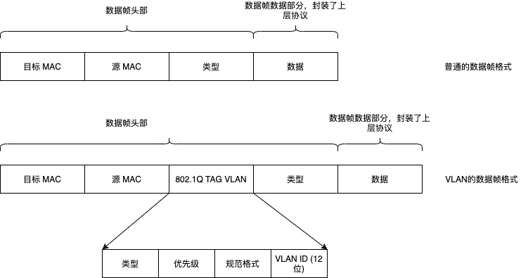
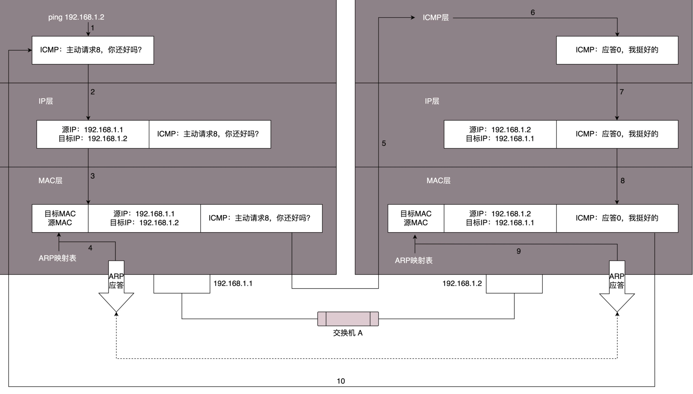

# Computer Network

> 总结计算机网络方面的知识。

### 网络协议

毋庸置疑，协议是重要的，随处可见又非常必要。如果我们讨论计算机网络下的协议，它就是计算机与计算机之间通过网络通信时事先达成的一种"约定"。这种约定使那些由不同厂商的设备、不同的 CPU 以及不同的操作系统组成的计算机之间，只要遵循相同的协议就能够实现通信。协议是不同实体之间通信的基础，它也是不同厂商能够实现分工的基础。

而计算机网络世界中的协议是由一些专门的组织来制定的，不管是网络提供商，还是设备商，还是使用者，都遵循这个协议。如果没有一套标准的网络协议，每个厂商、每个提供商都有自己的一套东西，那么这个世界就会变得混乱，因为没有人知道对方在讲什么，标准化是趋势也是必然。ISO 制定了国际标准 OSI，对通信做了标准化，但是 TCP/IP 并不是 ISO 制定的，而是由 IETF 建议和推进的，目前落地的网络协议是 TCP/IP 协议族。比如：

1. 物理层
2. 链路层: ARP, VLAN, STP
3. 网络层: ICMP, IP, OSPF, BGP, IPSec, GRE
4. 传输层: TCP, UDP
5. 应用层: DHCP, HTTP, HTTPS, P2P, DNS, RPC, GTP, RTMP

另外一个比较重要的东西是传输，如何将一台计算机上的数据传输到其他计算机或者网络设备上。从不同的上下文来讲，传输也有不同的含义：

* 在网络协议传输层中传输的含义是一个高层抽象的概念，它假定了由下层来完成实际的数据传输，传输层来对数据传输做控制。根据发送方式可以归为面向有连接和面向无连接。面向有连接是在发送数据前先打开一个连接，然后发送数据，发送完成后关闭连接，如果无法建立连接就可以避免发送无谓的数据；面向无连接不要求建立连接，可以自由发送数据
* 在物理层和链路层，传输的含义是实实在在的将 bit 数据从一个设备发送到另一个设备

#### 两种网络通信方式：电路交换和分组交换

* 电路交换的历史比较久，主要用于电话网时代。在电路交换中，交换机主要负责数据的中转处理，计算机首先被连接到交换机上，交换机与交换机之间有诸多通信线路连接，在通信使需要通过交换机与目标主机建立连接，一旦成功建立连接，用户就可以一直使用这个连接，直到连接被断开；如果有很多个计算机之间需要通信，这种通信方式就会有问题，因为通信线路毕竟是有限的，过多的并发用户会导致通信线路不够，从而无法实现正常通信；
* 分组交换是一种新的交换技术，他解决了电路交换的痛点，基本原理是将计算机所有发送的数据分成多个数据包，按照一定的顺序排列后分别发送；在分组交换的方式下，所有的计算机可以同时收发数据，提高了通信线路的利用率；一个重要的问题是：在分组交换方式下，如何避免数据包的混乱，也就是说如何区分 A 发给 B 的数据包与 A 发给 C 的数据包呢？使用的方式就是在分组数据中写入发送方和收取方的地址。可以说分组交换是 TCP/IP 得以实现的基石。

#### 单播 / 广播 / 多播 / 任播

1. 单播是一种 1 对 1 的通信方式，固定电话通信就是一种单播的例子
2. 广播是在同一个数据链内的网络设备可以收到广播消息
3. 多播相对于广播，限定了范围，只有在特定组内的网络设备才可以接收到数据
4. 任播是在特定的多台主机中任意选择一台符合要求的主机，然后和这个主机进行通信，比如 DNS 根域名解析器

#### 计算机网络实际的构成要素

1. 网卡，每个计算机都必须至少有一个物理网卡才能实现网络通信
2. 中继器和集线器，中继器是对减弱的信号进行放大和发送的设备；中继器通过物理层的连接延长网络；即使在数据链路层出现某些错误，中继器仍然转发数据；中继器无法改变传输速率；可见，中继器工作在物理层
3. 网桥 / 2 层交换机
4. 路由器 / 3 层交换机
5. 4 ～ 7 层交换机，比如负载均衡器设备，广域网加速器等
6. 网关，它负责协议的转换和数据的转发，在同一种类型的协议之间转发数据叫做应用网关

### 数据链路

计算机网络最基础的东西就是数据链路，它构成了整个网络的基础物理通道。当然数据链路层也有协议，它定义了通过通信媒介互连的设备之间传输的规范。数据链路是让互联计算机之间相互通信的一种协议，又指通信手段。

设备之间在传输数据时，数据链路层和物理层是必不可少的，计算机以0，1二进制来表示信息，而实际的物理通信媒介之间处理的却是电压的高低、光的闪灭以及电波的强弱等信号，把这些信号与二进制的 0，1 进行转换是物理层做的事情；而数据链路层处理的数据不是 0，1 序列，而是把 0，1 序列集合成一个叫做数据帧的块，然后进行传输。数据链路可以被视为网络传输中的最小单位，而互联网可以看作数据链路的集合。

#### 从介质来看数据链路

网络可以分为共享介质和非共享介质。

* 共享介质型网络

最早的以太网、FDDI 都是介质共享型网络，这种方式下设备之间使用同一个载波信道进行发送和接收，并且要对介质进行访问控制。根据访问控制方式的不同，可以分为信道竞争和令牌传递等方式，各有不同。在信道竞争方式下，以太网应用的是带冲突检测的载波监听多路访问 \(CSMA/CD\)，基本原理是：

1. 确认链路中没有任何设备发送数据
2. 开始发送数据
3. 在发送数据的同时，监控是否出现冲突，通过检测电压的方式等
4. 如果发生了冲突，就先阻塞报文的发送，然后放弃发送数据，在随机的一段时间后进行重发

采用 CSMA/CD 方式的以太网，要先判断是否可以通信，可以通信就独占通信介质发送数据，显然它不能同时接收数据和发送数据，所以说是一种半双工的通信方式；它的缺点是传输速率是受限制的，有时会导致介质的利用率不高

* 非共享介质网络

非共享介质是一种不共享介质的传输控制方式；网络中的每个站都直接连交换机，由交换机负责转发数据帧，发送端和接收端不共享通信介质；目前以太网也采用这种方式，计算机和交换机之间形成一对一的连接，实现了全双工通信，这种方式不会出现冲突，所以实现了更高效的通信。

#### 数据帧转发

在数据链路层需要解决几个问题，在物理层发送数据采用的是广播，在同一个网络环境中的设备都能收到，但是：

1. 数据包是发给谁的？谁来接收？
2. 大家都在发，是否有谁先发谁后发的规则，会不会发生混乱？
3. 发送的时候出错了怎么解决？

数据链路层引入了物理地址的概念，也就是 MAC 地址，也叫链路层地址，在链路层的数据帧中有一个头部，头部写清楚了目标 MAC 地址和源 MAC 地址，同时还有另外一个类型字段，来表示数据帧的数据部分是一个什么类型的数据协议包，一般有 IP / ARP / RARP 等；每个计算机和网络设备都会有一个 MAC 地址，通过数据帧的头部信息就可以判断这个数据包是发给谁的，谁可以接收。

都在发，是否有谁先发谁后发的规则，会不会发生混乱？以太网使用了随机介入协议来解决这个问题，如果发送数据时网络介质中出现了冲突，就等待一个随机时间后重发。

对于以太网，数据帧的最后是一个 CRC，用来做数据检测，来计算整个包是否在发送的过程中出现了错误。

但是在数据转发时，我们在数据帧里封装的是目标机器的 MAC 地址，一开始每个机器是不知道另外一个机器的 MAC 地址的，怎么办？这个时候就可以通过 ARP 协议来查找，ARP 协议就是通过 IP 地址查找 MAC 地址的协议，在同一个局域网中，当知道了一个机器的 IP 地址后，通过发送广播包的方式来获取 MAC 地址，拥有目标 IP 的机器会回复一个数据包来应答，告诉询问的机器它的 MAC 地址是多少；这个时候这台机器就知道了 IP 地址和 MAC 地址的对应关系，就可以缓存在自己这里，下次就可以通过查表的方式找到某个 IP 对应的 MAC（当然这个缓存是有一定过期时间的）

通常情况下，在一个局域网中的多台计算机是连接在一个或多个交换机上的，当发出一个数据包时，交换机负责接收数据包并从特定的端口发送出去（因为所有端口都转发，会浪费带宽资源），但是交换机是怎么知道从哪个口发送出去的呢？因为交换机具备自学的能力，并且在交换机内部有一个转发表，记录了某个 MAC 地址对应的端口，但这个转发表是有过期时间的。

#### 环路检测

我们知道交换机有自学能力的，但是当交换机的数量多了以后，网络的拓扑结构就会变的复杂起来，既有可能会遇到环路问题，让网络包迷路，这个时候该怎么办？环路问题的起因是由于同一个数据帧在环路中不端的被转发，这种数据帧在网络中越积越多，最终会导致网络瘫痪。

STP 协议就是一种解决环路问题的方式。STP 协议比较复杂，日后补充。

#### VLAN

机器多了之后，交换机也会变多，就算交换机比 Hub 智能一些，但是还是难免有广播的问题，一种解决方式就是使用虚拟隔离，也就是 VLAN 虚拟局域网。

使用 VLAN，一个交换机上会连属于多个局域网的机器，那交换机怎么区分哪个机器属于哪个局域网呢？只需要在原来的二层的头上加一个 TAG，里面有一个 VLAN ID，一共 12 位，如下图。如果交换机是支持 VLAN 的，当这个交换机把二层的头取下来的时候，就能够识别这个 VLAN ID。这样只有相同 VLAN 的包，才会互相转发，不同 VLAN 的包，是看不到的。这样广播问题和安全问题就都能够解决了。\(可以设置交换机每个口所属的 VLAN。\)



交换机之间怎么连接呢？将两个交换机连接起来的口应该设置成什么 VLAN 呢？对于支持 VLAN 的交换机，有一种口叫作 Trunk 口。它可以转发属于任何 VLAN 的口。交换机之间可以通过这种口相互连接。

#### 以太网

以太网是目前使用最广泛的数据链路。怎么理解以太网？

1. 是一种通信方式
2. 有一整套规范和协议
3. 以太网下的网卡和驱动程序实现简单，相对其他类型的通信方式实现要更加低廉
4. 现在，以太网支持高速网络，已经成为最具兼容性和未来发展性的一种数据链路

### 重新认识 ping



ping 命令执行的时候，源主机首先会构建一个 ICMP 请求数据包，ICMP 数据包内包含多个字段。最重要的是两个，第一个是类型字段，对于请求数据包而言该字段为 8；另外一个是顺序号，主要用于区分连续 ping 的时候发出的多个数据包。每发出一个请求数据包，顺序号会自动加 1。为了能够计算往返时间 RTT，它会在报文的数据部分插入发送时间。

然后，由 ICMP 协议将这个数据包连同地址 192.168.1.2 一起交给 IP 层。IP 层将以 192.168.1.2 作为目的地址，本机 IP 地址作为源地址，加上一些其他控制信息，构建一个 IP 数据包。

接下来，需要加入 MAC 头。如果在本节 ARP 映射表中查找出 IP 地址 192.168.1.2 所对应的 MAC 地址，则可以直接使用；如果没有，则需要发送 ARP 协议查询 MAC 地址，获得 MAC 地址后，由数据链路层构建一个数据帧，目的地址是 IP 层传过来的 MAC 地址，源地址则是本机的 MAC 地址；还要附加上一些控制信息，依据以太网的介质访问规则，将它们传送出去。

主机 B 收到这个数据帧后，先检查它的目的 MAC 地址，并和本机的 MAC 地址对比，如符合，则接收，否则就丢弃。接收后检查该数据帧，将 IP 数据包从帧中提取出来，交给本机的 IP 层。同样，IP 层检查后，将有用的信息提取后交给 ICMP 协议。

主机 B 会构建一个 ICMP 应答包，应答数据包的类型字段为 0，顺序号为接收到的请求数据包中的顺序号，然后再发送出去给主机 A。在规定的时候间内，源主机如果没有接到 ICMP 的应答包，则说明目标主机不可达；如果接收到了 ICMP 应答包，则说明目标主机可达。此时，源主机会检查，用当前时刻减去该数据包最初从源主机上发出的时刻，就是 ICMP 数据包的时间延迟。

当然这只是最简单的，同一个局域网里面的情况。如果跨网段的话，还会涉及网关的转发、路由器的转发等等。但是对于 ICMP 的头来讲，是没什么影响的。会影响的是根据目标 IP 地址，选择路由的下一跳，还有每经过一个路由器到达一个新的局域网，需要换 MAC 头里面的 MAC 地址。

如果在自己的可控范围之内，当遇到网络不通的问题的时候，除了直接 ping 目标的 IP 地址之外，还应该有一个清晰的网络拓扑图。并且从理论上来讲，应该要清楚地知道一个网络包从源地址到目标地址都需要经过哪些设备，然后逐个 ping 中间的这些设备或者机器。如果可能的话，在这些关键点，通过 tcpdump -i eth0 icmp，查看包有没有到达某个点，回复的包到达了哪个点，可以更加容易推断出错的位置。

### 重新认识 traceroute

traceroute 使用 ICMP 的规则，故意制造一些能够产生错误的场景。

Traceroute 的第一个作用就是故意设置特殊的 TTL，来追踪去往目的地时沿途经过的路由器。Traceroute 的参数指向某个目的 IP 地址，它会发送一个 UDP 的数据包。将 TTL 设置成 1，也就是说一旦遇到一个路由器或者一个关卡，就表示它“牺牲”了。

Traceroute 还有一个作用是故意设置不分片，从而确定路径的 MTU。要做的工作首先是发送分组，并设置“不分片”标志。发送的第一个分组的长度正好与出口 MTU 相等。如果中间遇到窄的关口会被卡住，会发送 ICMP 网络差错包，类型为“需要进行分片但设置了不分片位”。每次收到 ICMP“不能分片”差错时就减小分组的长度，直到到达目标主机。

在 Linux 上，traceroute 命令用于追踪数据包在网络上的传输时的全部路径，它默认发送的数据包大小是40字节。

通过traceroute我们可以知道信息从你的计算机到互联网另一端的主机是走的什么路径。当然每次数据包由某一同样的出发点（source）到达某一同样的目的地\(destination\)走的路径可能会不一样，但基本上来说大部分时候所走的路由是相同的。

traceroute通过发送小的数据包到目的设备直到其返回，来测量其需要多长时间。一条路径上的每个设备traceroute要测3次。输出结果中包括每次测试的时间\(ms\)和设备的名称（如有的话）及其ip地址。

traceroute 的使用与解释可以参考：

1. [https://wangchujiang.com/linux-command/c/traceroute.html](https://wangchujiang.com/linux-command/c/traceroute.html)
2. [https://www.cnblogs.com/machangwei-8/p/10353279.html](https://www.cnblogs.com/machangwei-8/p/10353279.html)

### 重新认识 ifconfig

在电脑上查看 ip 地址时，经常使用 ifconfig 或 ipconfig, 有时候也可以使用 ip addr 命令。

```text
$ ip addr
1: lo: <LOOPBACK,UP,LOWER_UP> mtu 65536 qdisc noqueue state UNKNOWN group default qlen 1000
    link/loopback 00:00:00:00:00:00 brd 00:00:00:00:00:00
    inet 127.0.0.1/8 scope host lo
       valid_lft forever preferred_lft forever
    inet6 ::1/128 scope host
       valid_lft forever preferred_lft forever
2: enp0s3: <BROADCAST,MULTICAST,UP,LOWER_UP> mtu 1500 qdisc fq_codel state UP group default qlen 1000
    link/ether 02:6a:93:8d:eb:87 brd ff:ff:ff:ff:ff:ff
    inet 10.0.2.15/24 brd 10.0.2.255 scope global dynamic enp0s3
       valid_lft 86362sec preferred_lft 86362sec
    inet6 fe80::6a:93ff:fe8d:eb87/64 scope link
       valid_lft forever preferred_lft forever
3: enp0s8: <BROADCAST,MULTICAST,UP,LOWER_UP> mtu 1500 qdisc fq_codel state UP group default qlen 1000
    link/ether 08:00:27:bb:49:66 brd ff:ff:ff:ff:ff:ff
    inet 192.168.33.100/24 brd 192.168.33.255 scope global enp0s8
       valid_lft forever preferred_lft forever
    inet6 fe80::a00:27ff:febb:4966/64 scope link
       valid_lft forever preferred_lft forever
```

运行之后，如果不出意外，会出现类似上面的内容，来分析一下\(我使用的是 ubuntu18.04, 其他系统可能会不一样\):

* 有三个网卡，分别是 lo, enp0s3, enp0s8; lo 表示 loopback, 也叫回环地址，专门用来访问本机的, 经过内核处理后直接返回，不会在任何网络中出现，一般通过 127.0.0.1 或者 localhost; enp0s3 和 enp0s8 是两个正常的网卡，但是也稍有不同，主要以 enp0s3 来分析
* 为什么叫 enp0s3 而不是类似 eth0 ? 这是一种新的命名方案，叫 `Predictable Network Interface`, 名称取决于硬件的物理位置: en 是 `ethernet` 的意思，就像 `eth` 用于对应 eth0 一样, p 是以太网卡的总线编号, s 是插槽编号
* `<BROADCAST,MULTICAST,UP,LOWER_UP>` 代表什么呢？它表示的是网络设备的状态标识

BROADCAST 表示该接口支持广播，MULTICAST 表示该接口支持多播，UP 表示网络接口已启用，LOWER\_UP 表示网络电缆已插入，设备已连接至网络

* mtu 1500 表示最大传输单位（数据包大小）为 1500 字节；mtu 是链路层的概念，MAC 层有 MAC 的头，**以太网规定连 MAC 头带正文合起来，不允许超过 1500 个字节**。正文里面有 IP 的头、TCP 的头、HTTP 的头。如果放不下，就需要分片来传输。
* qdisc fq\_codel state UP group default qlen 1000

qdisc 表示排队规则\(queueing discipline\), 内核如果需要通过某个网络接口发送数据包，它都需要按照为这个接口配置的 qdisc（排队规则）把数据包加入队列。qdisc 将流量队列抽象化，比标准的FIFO队列要复杂得多，实现了内核的流量管理功能，包括流量分类，优先级和速率协商，后续再仔细研究。

state UP 表示网络接口已经启用；qlen 1000 表示传输队列长度是 1000 个数据包，第 1000 个数据包将排队，第 1001 个数据包将被丢弃。

* link/ether 02:6a:93:8d:eb:87 brd ff:ff:ff:ff:ff:ff

link/ether 02:6a:93:8d:eb:87 表示网卡的 MAC 地址；brd ff:ff:ff:ff:ff:ff 表示广播地址, 这个广播地址是全1，说明是一个受限的广播地址，只能在同一个子网中传输，路由器不会转发出去

* inet 10.0.2.15/24 brd 10.0.2.255 scope global dynamic enp0s3 表示的是 ip 地址信息，10.0.2.15/24 是一种 CIDR 的表示方式；brd 10.0.2.255 是广播地址；scope global 表示全局有效；dynamic enp0s3 表示地址是动态分配的，动态分配一般是通过 DHCP 完成的；参考 IP 地址划分
* valid\_lft 86362sec 表示 IPv4 地址的有效使用期限，preferred\_lft 表示 IPv4 地址的首选生存期
* inet6 fe80::a00:27ff:febb:4966/64 scope link 表示 ipv6 地址, scope link 表示私有地址，只在此设备上有效

```text
$ brctl show
bridge name    bridge id            STP     enabled          interfaces
docker0        8000.0242d2aa78fc     no                       veth2b5bd65
                                                              veth40fb187
                                                              veth5303445
                                                              veth64223f0
                                                              veth6fc2d07
                                                              vethb0807c3
                                                              vethb095dc1
                                                              vethfcc2eca
```

brctl show 用来查看当前主机上的虚拟交换机，docker0 是这个虚拟交换机的名称，interfaces 表示加入到这个虚拟交换机的网络设备。

### 网关

网关往往是一个路由器，是一个三层转发的设备。路由器是一台设备，它有五个网口或者网卡，相当于有五只手，分别连着五个局域网。每只手的 IP 地址都和局域网的 IP 地址相同的网段，每只手都是它握住的那个局域网的网关。

任何一个想发往其他局域网的包，都会到达其中一只手，被拿进来，拿下 MAC 头和 IP 头，看看，根据自己的路由算法，选择另一只手，加上 IP 头和 MAC 头，然后扔出去。

MAC 地址是一个局域网内才有效的地址。因而，MAC 地址只要过网关，就必定会改变，因为已经换了局域网。两者主要的区别在于 IP 地址是否改变。不改变 IP 地址的网关，我们称为转发网关；改变 IP 地址的网关，我们称为 NAT 网关。

不是只有路由器才可以作为网关，比如某台 Linux 主机也可以作为网关，只要做好设置；从表现上来看，网关是一个提供了特殊能力的 IP 地址，同一个网段的其他机器，把数据发送到这个 IP 上，然后由网关去处理后面的事情，所以网关具备路由的功能，所以网关一定是运行了具有路由功能的软件，它也一定有一个自己的路由表，来决定下一步的动作。

详细参考：

1. [https://www.jianshu.com/p/122ac247f772](https://www.jianshu.com/p/122ac247f772)

### Routing tables

路由表的作用就是指定下一级网关，根据路由表怎么确定下一级网关，这里就有一个匹配过程，匹配规则：

1. 最长匹配
2. 优先级匹配

[http://linux-ip.net/html/routing-tables.html](http://linux-ip.net/html/routing-tables.html)

[http://linux-ip.net/html/index.html](http://linux-ip.net/html/index.html)

[https://tldp.org/LDP/nag2/nag2.pdf](https://tldp.org/LDP/nag2/nag2.pdf)

### 概念与术语

| 类别 | 名称 | 解释 |
| :--- | :---: | :--- |
| 基础概念 | 互联网 | 一个互联网就是一组通过相同协议族互连在一起的网络。 |
| 基础概念 | 广播 | 广播是向在同一个网段中的所有主机发送数据包，详细参考 [广播地址介绍](https://blog.csdn.net/tennysonsky/article/details/45564479) |
| 基础概念 | [TUN/TAP](https://zh.wikipedia.org/wiki/TUN%E4%B8%8ETAP) | 操作系统内核中的虚拟网络设备, 这些虚拟的网络设备全部用软件实现，并向运行于操作系统上的软件提供与硬件的网络设备完全相同的功能 |
| 链路层 | [网桥](https://zh.wikipedia.org/wiki/%E6%A9%8B%E6%8E%A5%E5%99%A8) | 网桥是一个二层桥接设备，桥接就是把两端连接起来，但不是所有的流量都放行，只有目的 MAC 才可以通过 |
| 链路层 | MTU | 最大传输单位，以太网规定 MTU 最大为 1500 字节，其中包括 MAC 头和 MAC 正文 |
| 内核 | qdisc | Queuing Disciplines，排队规则 |
| 内核 | fq-codel | 排队规则的一种，主要致力于解决 [bufferbloat](https://en.wikipedia.org/wiki/Bufferbloat) 问题，可参考 [理解 fq-codl](https://www.jianshu.com/p/3b2e701f61ea) |
| 网络延迟 | bufferbloat | [bufferbloat](https://en.wikipedia.org/wiki/Bufferbloat) 是由数据包过多的缓冲导致数据包交换高延迟，也就是说它会影响某些应用的网络体验，可以翻译为缓冲区膨胀 |

### 网络相关的一些问题

* 当网络包到达一个路由器的时候，可以通过路由表得到下一跳的 IP 地址，直接通过 IP 地址找就可以了，为什么还要通过本地的 MAC 地址呢？
* net-tools 和 iproute2 有什么关系？

### Reference

* [Linux网络栈之队列](https://xiaoz.co/2019/12/14/Linux%E7%BD%91%E7%BB%9C%E6%A0%88%E4%B9%8B%E9%98%9F%E5%88%97-part1/#%E6%8E%92%E9%98%9F%E8%A7%84%E5%88%99-Queuing-Disciplines-QDisc)
* [Bufferbloat: Dark Buffers in the Internet](https://cacm.acm.org/magazines/2012/1/144810-bufferbloat/fulltext)


### [Linux 操作系统原理 — 内核网络协议栈](https://is-cloud.blog.csdn.net/article/details/102996612)

[https://www.ibm.com/developerworks/cn/linux/1310\_xiawc\_networkdevice/](https://www.ibm.com/developerworks/cn/linux/1310_xiawc_networkdevice/)

[【译】Linux网络栈之队列](https://xiaoz.co/2019/12/14/Linux%E7%BD%91%E7%BB%9C%E6%A0%88%E4%B9%8B%E9%98%9F%E5%88%97-part1/#%E6%8E%92%E9%98%9F%E8%A7%84%E5%88%99-Queuing-Disciplines-QDisc)

[https://www.coverfire.com/articles/queueing-in-the-linux-network-stack/](https://www.coverfire.com/articles/queueing-in-the-linux-network-stack/)

[https://opengers.github.io/openstack/openstack-base-virtual-network-devices-bridge-and-vlan/](https://opengers.github.io/openstack/openstack-base-virtual-network-devices-bridge-and-vlan/)

Todo List:

1. Linux TUN / TAP interface 的实现

### Linux 中 TCP 连接建立、通信、释放的全过程

Todo

### 实验环境

[https://www.jianshu.com/p/4e893b5bfe81](https://www.jianshu.com/p/4e893b5bfe81) kvm, qemu, qemu-kvm

虚拟机网络 网络实验环境搭建

#### 简单的实验环境

大部分人使用的是 Windows 和 Mac Book, 我们使用虚拟机可以在自己的电脑上轻松搞个网络环境，需要先准备好：

1. VirtualBox
2. Vagrant \(可选，方便启动 VirtualBox\)
3. 下载 Vagrant Box 镜像或者 Linux 系统的 ISO 镜像，如 Ubuntu 18.04, Centos 7

大致思路：在 MacOS 或者 Windows 上安装 VirtualBox，用 VirtualBox 启动一个 Ubuntu 18.04 的 VM，VM 的网络配置可以使用桥接模式，在 VM 中安装 KVM 相关的软件，然后就可以使用 KVM 来虚拟化出多个 VM，比如可以用 KVM 创建多个 VM 并配置相关的网络

#### 复杂的实验环境

---

分析工具

* wireshark

[Wireshark 详细教程-如果看了这个你还是不会用Wireshark-那就来找我吧](https://www.dell.com/community/%E5%85%A5%E9%97%A8%E7%BA%A7%E5%92%8C%E4%B8%AD%E7%AB%AF/%E5%A6%82%E6%9E%9C%E7%9C%8B%E4%BA%86%E8%BF%99%E4%B8%AA%E4%BD%A0%E8%BF%98%E6%98%AF%E4%B8%8D%E4%BC%9A%E7%94%A8Wireshark-%E9%82%A3%E5%B0%B1%E6%9D%A5%E6%89%BE%E6%88%91%E5%90%A7-8%E6%9C%886%E6%97%A5%E5%AE%8C%E7%BB%93/td-p/7007033)

* tcpdump


