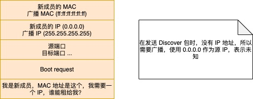

# DHCP 工作原理

### DHCP 简介

DHCP \(Dynamic Host Configuration Protocol\) 是动态主机配置协议。

网络是我们目前生活中必不可少的一部分，上网也是每天都在做的事情；了解一些计算机网络原理的人都知道，如果要能够访问网络，设备就必须配置一个 IP 地址，但是我们又不能为每一个设备都手动去配置，因为太繁琐，而且在不同网络环境中，IP 地址也很有可能是不一样的（比如不同的网段等），DHCP 就是来解决这个问题的，当有一台新的计算机加入到网络后，这台计算机会自动获取一个 IP 地址，并且这个 IP 地址是有租期的。

简单总结一下，DHCP 协议实现了自动设置 IP 地址、统一管理 IP 地址分配等功能。

#### DHCP 协议怎么工作

前提：要使用 DHCP 带来的便利，一个前提是所接入的网络中必须有至少一个 DHCP 服务器，否则就必须手动配置 IP、子网掩码和网关等信息。

工作原理：

* 网络中需要有一台 DHCP 服务器，并做一些配置，比如可分配的 IP 范围、子网掩码、网关路由信息等，一般网络中的路由器会内置 DHCP 服务的
* DHCP Discover 阶段，新接入网络的计算机会发送一个广播包\(也叫 DHCP 发现包\)，这个包的源 IP 0.0.0.0，目的 IP 地址为 255.255.255.255，广播包封装了 UDP，UDP 封装了 BOOTP；此外，发送广播包的计算机肯定知道自己的 MAC 地址，于是在局域网中传播的数据链路层的数据帧如下：

* DHCP Offer 阶段，客户机的广播包在网络中传输时，DHCP 服务接收到后会去处理, 并为此客户保留为它提供的 IP 地址，从而不会为其他 DHCP 客户分配此 IP 地址，DHCP Server 仍然使用广播地址作为目的地址，因为，此时请求分配 IP 的客户机还没有自己的 IP。
* DHCP 选择阶段，当新接入的计算机收到 DHCP 的回复后，会选择其中一个 DHCP Offer，一般是最先到达的那个，并且会向网络发送一个 DHCP Request 广播数据包，包中包含客户端的 MAC 地址、接受的租约中的 IP 地址、提供此租约的 DHCP 服务器地址等，并告诉所有 DHCP Server 它将接受哪一台服务器提供的 IP 地址，告诉其他 DHCP 服务器，谢谢你们的接纳，并请求撤销它们提供的 IP 地址，以便提供给下一个 IP 租用请求者，此时，由于还没有得到 DHCP Server 的最后确认，客户端仍然使用 0.0.0.0 为源 IP 地址、255.255.255.255 为目标地址进行广播。在 BOOTP 里面，接受某个 DHCP Server 的分配的 IP。
* DHCP ACK 阶段，DHCP Server 接收到客户机的 DHCP request 之后，会广播返回给客户机一个 DHCP ACK 消息包，表明已经接受客户机的选择，并将这一 IP 地址的合法租用信息和其他的配置信息都放入该广播包，发给客户机，到此，IP 地址的动态分配就完成了
* DHCP 续租阶段，客户机会在租期过去 50% 的时候，直接向为其提供 IP 地址的 DHCP Server 发送 DHCP request 消息包。客户机接收到该服务器回应的 DHCP ACK 消息包，会根据包中所提供的新的租期以及其他已经更新的 TCP/IP 参数，更新自己的配置。这样，IP 租用更新就完成了。
* DHCP IP 收回，如果客户机发送 DHCP 解除包，会解除 IP 地址的分配，并被 DHCP 回收

