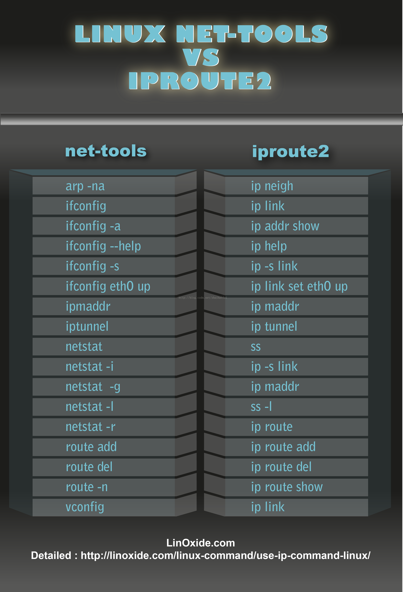

# 网络相关命令

网络无处不在，不可避免的要查看和配置网络相关的内容，此篇汇总一些网络相关的常用命令

命令列表：

1. 网络配置：ifconfig、ip
2. 连通性探测：ping、traceroute、telnet、mtr
3. 网络连接：netstat、ss、nc、lsof
4. 流量统计：ifstat、 sar、 iftop
5. 交换与路由：arp、arping、vconfig、route
6. 防火墙：iptables、ipset
7. 域名：host、nslookup、dig、whois
8. 抓包：tcpdump
9. 虚拟设备：tunctl、brctl、ovs

和网络相关的配置文件：

1. /etc/hosts：域名到 IP 地址的映射
2. /etc/networks：网络名称到 IP 地址的映射
3. /etc/resolv.conf：DNS域名地址
4. /etc/protocols：协议名称到协议编号的映射
5. /etc/services：TCP/UDP 服务名称到端口号的映射

### 网络工具包

net-tools 和 iproute2 是两个网络工具包，iproute2 的目的是逐渐取代 net-tools，但是到目前为止 net-tools 还在广泛使用，这两个网络工具包一般系统都会默认安装。

net-tools 是通过 procfs\(/proc\) 和 ioctl 系统调用去访问和改变内核网络配置，而 iproute2 则通过 netlink 套接字接口与内核通讯。



### 常用操作

* 查看机器的路由表信息、网关等

```text
// 查看路由表和网关信息
$ netstat -rn
Kernel IP routing table
Destination     Gateway         Genmask         Flags   MSS Window  irtt Iface
0.0.0.0         10.0.2.2        0.0.0.0         UG        0 0          0 eth0
10.0.2.0        0.0.0.0         255.255.255.0   U         0 0          0 eth0
10.0.2.2        0.0.0.0         255.255.255.255 UH        0 0          0 eth0
172.17.0.0      0.0.0.0         255.255.0.0     U         0 0          0 docker0
192.168.99.0    0.0.0.0         255.255.255.0   U         0 0          0 eth1

$ route -n
Kernel IP routing table
Destination     Gateway         Genmask         Flags Metric Ref    Use Iface
0.0.0.0         10.0.2.2        0.0.0.0         UG    1024   0        0 eth0
10.0.2.0        0.0.0.0         255.255.255.0   U     0      0        0 eth0
10.0.2.2        0.0.0.0         255.255.255.255 UH    1024   0        0 eth0
172.17.0.0      0.0.0.0         255.255.0.0     U     0      0        0 docker0
192.168.99.0    0.0.0.0         255.255.255.0   U     0      0        0 eth1

$ traceroute www.baidu.com
traceroute to www.baidu.com (180.101.49.11), 30 hops max, 46 byte packets
 1  10.0.2.2 (10.0.2.2)  0.158 ms  0.137 ms  0.166 ms
 2  192.168.115.1 (192.168.115.1)  3.388 ms  2.609 ms  3.400 ms
 3  172.19.100.1 (172.19.100.1)  8.578 ms  3.314 ms  3.567 ms
 4  192.167.1.1 (192.167.1.1)  5.013 ms  8.504 ms  3.323 ms
 5  1.8.78.124.broad.xw.sh.dynamic.163data.com.cn (124.78.8.1)  7.636 ms  9.332 ms  6.361 ms
 6  61.152.0.21 (61.152.0.21)  35.245 ms  61.152.30.161 (61.152.30.161)  4.745 ms  61.152.0.21 (61.152.0.21)  18.392 ms
 7  61.152.24.74 (61.152.24.74)  4.263 ms  61.152.25.162 (61.152.25.162)  5.239 ms  61.152.25.150 (61.152.25.150)  5.231 ms
 8  202.97.29.126 (202.97.29.126)  10.216 ms  202.97.19.254 (202.97.19.254)  6.340 ms  202.97.74.150 (202.97.74.150)  6.716 ms
 9  58.213.94.118 (58.213.94.118)  11.843 ms  58.213.95.102 (58.213.95.102)  12.451 ms  58.213.94.114 (58.213.94.114)  12.739 ms

 $ ip route show
default via 10.0.2.2 dev eth0 proto dhcp src 10.0.2.15 metric 1024
10.0.2.0/24 dev eth0 proto kernel scope link src 10.0.2.15
10.0.2.2 dev eth0 proto dhcp scope link src 10.0.2.15 metric 1024
172.17.0.0/16 dev docker0 proto kernel scope link src 172.17.0.1
192.168.99.0/24 dev eth1 proto kernel scope link src 192.168.99.101
```

1. via: [https://www.cyberciti.biz/faq/how-to-find-gateway-ip-address/](https://www.cyberciti.biz/faq/how-to-find-gateway-ip-address/)

### ip

[https://juejin.cn/post/6844903844267180039\#heading-6](https://juejin.cn/post/6844903844267180039#heading-6)

[https://www.softprayog.in/tutorials/ip-command-in-linux](https://www.softprayog.in/tutorials/ip-command-in-linux)

[https://phoenixnap.com/kb/linux-ip-command-examples](https://phoenixnap.com/kb/linux-ip-command-examples)

### tcpdump

[https://cloud.tencent.com/developer/article/1432605](https://cloud.tencent.com/developer/article/1432605)

[https://danielmiessler.com/study/tcpdump/](https://danielmiessler.com/study/tcpdump/)

[http://bencane.com/2014/10/13/quick-and-practical-reference-for-tcpdump/](http://bencane.com/2014/10/13/quick-and-practical-reference-for-tcpdump/)

### iptables

[https://ivanzz1001.github.io/records/post/linuxops/2018/10/17/linux-iptables](https://ivanzz1001.github.io/records/post/linuxops/2018/10/17/linux-iptables)

### 创建 Bridge

```text
# 创建网桥
sudo brctl addbr br0
# 开启网桥
sudo ifconfig br0 up
# 查看网桥
ifconfig br0

# 创建两个 tap 接口
sudo ip tuntap add dev tap0 mod tap
sudo ip tuntap add dev tap1 mod tap

# 启用
sudo ifconfig tap0 0.0.0.0 up
sudo ifconfig tap1 0.0.0.0 up

ifcofnig tap0
ifcofnig tap1

# 绑定到 Bridge
sudo brctl addbr br0 tap0
sudo brctl addbr br0 tap1

# 查看
$ brctl show
bridge name    bridge id        STP enabled    interfaces
br0        8000.36c4ca8fc8e0    no        tap1
                                    tap0

# 移除
sudo brctl delif br0 tap0
sudo brctl delif br0 tap1

# 删除设备
sudo ip link delete tap0
sudo ip link delete tap1

sudo ifconfig br0 down
sudo brctl delbr br0

virbr0-nic 是一个 dummy interface
```

