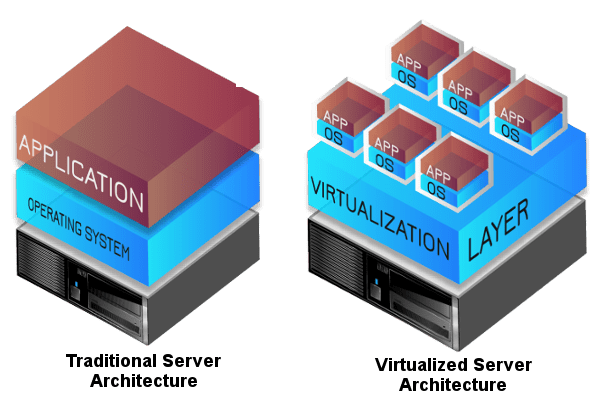
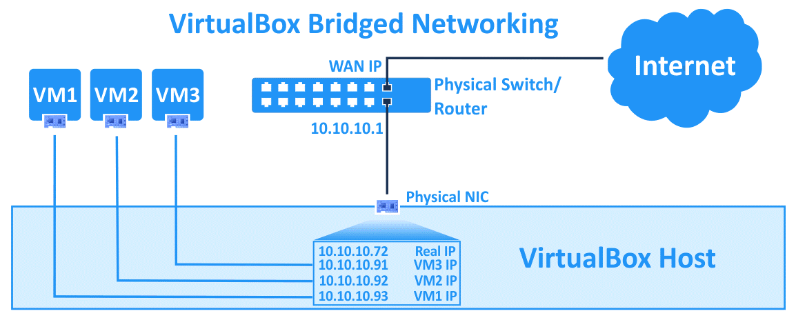
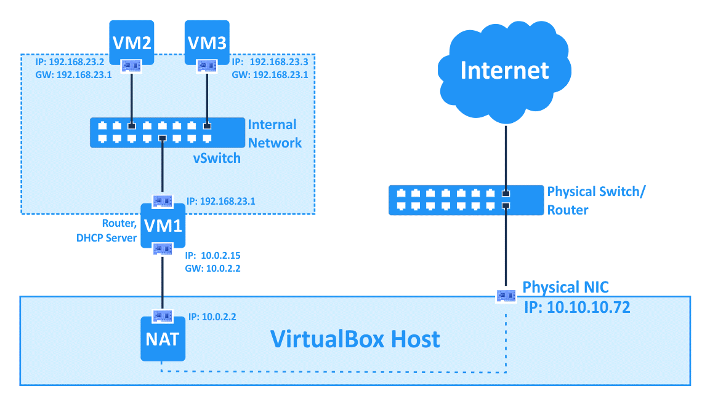

# 网络虚拟化

[https://www.nakivo.com/blog/virtualbox-network-setting-guide/](https://www.nakivo.com/blog/virtualbox-network-setting-guide/)

[https://www.virtualbox.org/manual/ch06.html](https://www.virtualbox.org/manual/ch06.html)

[https://github.com/byte-edu/openstack](https://github.com/byte-edu/openstack)

[https://segmentfault.com/a/1190000015418876](https://segmentfault.com/a/1190000015418876)

[https://xiaoz.co/2020/01/08/libvirt-virbr0/](https://xiaoz.co/2020/01/08/libvirt-virbr0/)

### 虚拟化

首先，如何理解虚拟化？

虚拟化是将物理 IT 资源转化为虚拟 IT 资源的过程，如服务器转化为虚拟机，存储转化为虚拟存储，网络转化为虚拟网络。

传统的服务器架构中，会有一个物理硬件，在这个硬件上会托管一个操作系统，并在上面安装应用程序。如果我们想要多于一台机器，我们就需要购买那么多的硬件，并在上面托管一个操作系统和安装我们的应用程序，这是一个非常昂贵的过程，并且需要更多的维护。相反，为什么我们不能有一个高端的硬件，有巨大的计算和存储能力，我们可以在上面安装一个以上的操作系统？是的，这是可能的，这个过程我们称之为虚拟化。

在一个硬件上，会有另外一层，我们称之为虚拟化层或 Hypervisor。在这一层，我们可以承载任何数量的虚拟机（取决于物理硬件的计算能力）。如下图：



如上图所示，在虚拟化服务器架构中，有一个物理硬件，在这个物理硬件上有一个虚拟层，我们称之为虚拟主机。在这个虚拟主机上，有多个容器，每个容器都安装了独立的操作系统，比如一个容器安装了windows，另一个容器安装了Linux，因为每个容器都是虚拟的独立系统，所以没有限制。而这些容器被称为虚拟机。

#### Understanding Hypervisor

> Hypervisor creates the Virtualization Layer and monitors manages all virtual machines \(VMM – Virtual machine management/Monitor\). In other terms, we can say it will provide an illusion that each OS is running on their own physical hardware.

#### KVM

基于内核的虚拟机 Kernel-based Virtual Machine（KVM）是一种内建于 Linux 中的开源虚拟化技术。具体而言，KVM 可帮助您将 Linux 转变为虚拟机监控程序，使主机计算机能够运行多个隔离的虚拟环境，即虚拟客户机或虚拟机（VM）。

KVM 是 Linux 的一部分。Linux 也是 KVM 的一部分。Linux 有的，KVM 全都有。然而，KVM 的某些特点让它成为了企业的首选虚拟机监控程序。

1. [What is kvm - RedHat](https://www.redhat.com/zh/topics/virtualization/what-is-KVM)

### 虚拟网卡

虚拟机和容器已经成为标配。它们背后的网络管理都离不开一样东西，就是虚拟网络设备，或者叫虚拟网卡，tap/tun 就是在云计算时代非常重要的虚拟网络网卡。

#### TAP / TUN

tap/tun 是 Linux 内核 2.4.x 版本之后实现的虚拟网络设备，不同于物理网卡靠硬件网路板卡实现，tap/tun 虚拟网卡完全由软件来实现，功能和硬件实现完全没有差别，它们都属于网络设备，都可以配置 IP，都归 Linux 网络设备管理模块统一管理。

TAP 等同于一个以太网设备，它操作第二层数据包如以太网数据帧。TUN 模拟了网络层设备，操作第三层数据包比如 IP 数据封包。

作为网络设备，tap/tun 也需要配套相应的驱动程序才能工作。tap/tun 驱动程序包括两个部分，一个是字符设备驱动，一个是网卡驱动。这两部分驱动程序分工不太一样，字符驱动负责数据包在内核空间和用户空间的传送，网卡驱动负责数据包在 TCP/IP 网络协议栈上的传输和处理。

**TAP / TUN interface**

> TUN/TAP 为用户空间程序提供数据包的接收和传输。它可以看作是一个简单的点对点或以太网设备，它不是从物理介质接收数据包，而是从用户空间程序接收数据包，也不是通过物理介质发送数据包，而是将数据包写入用户空间程序。也就是说 TUN/TAP 接口是没有物理设备关联的虚拟接口。用户空间程序可以附加到 TUN/TAP 接口上，并处理发送到该接口的流量。

1. via: [https://www.cnblogs.com/bakari/p/10450711.html](https://www.cnblogs.com/bakari/p/10450711.html)

### 网络虚拟化

### 虚拟网络模式

以 VirtualBox 为例，每个 VirtualBox 虚拟机最多可以使用 8 个虚拟网络适配器，每个适配器又称为网络接口控制器 \(NIC\)。在 VirtualBox GUI（图形用户界面）中可以配置四个虚拟网络适配器。所有虚拟网络适配器 \(最多 8 个\) 都可以使用 VBoxManage modifyvm 命令进行配置。VBoxManage 是 VirtualBox 的命令行管理工具，可用于配置所有 VirtualBox 设置，包括 VirtualBox 网络设置。可以在虚拟机设置中访问 VirtualBox 网络适配器设置。

#### NAT

此网络模式默认为虚拟网络适配器启用, 虚拟机上的访客操作系统可以通过使用虚拟 NAT（网络地址转换）设备访问物理局域网（LAN）中的主机。外部网络（包括互联网）可从访客操作系统访问。当 NAT 模式用于 VirtualBox 联网时，访客机无法访问主机，也无法从网络中的其他机器访问。这种默认的网络模式对于希望将虚拟机仅用于互联网访问的用户来说已经足够了。

虚拟机网络适配器的 IP 地址是通过 DHCP 获得的，在此网络模式下使用的网络 IP 地址不能在 GUI 中更改。VirtualBox 内置了 DHCP 服务器和 NAT 引擎。虚拟 NAT 设备将 VirtualBox 主机的物理网络适配器作为外部网络接口，NAT 模式中使用的虚拟 DHCP 服务器的默认地址是 10.0.2.2（这也是虚拟机默认网关的IP地址），网络掩码是255.255.255.0。

如果将两个或多个虚拟机的网络适配器配置为使用 NAT 模式，则每个虚拟机将在私有虚拟 NAT 设备后面的自己的隔离网络中获取 10.0.2.15 IP地址。每个虚拟机的默认网关为 10.0.2.2，在 VirtualBox 中，当使用 NAT 模式时，IP 地址是不会改变的。


NAT 网络的原理是当私有网主机和公共网主机通信的 IP 包经过 NAT 网关时，将 IP 包中的源 IP 或目的 IP 在私有 IP 和 NAT 的公共 IP 之间进行转换。

VBox 中的 NAT 借助了 VBox 内置的 NAT 引擎和 DHCP 服务，在 VBox 管理程序的网络图形界面下，除了将虚拟机放入NAT以及端口转发外，没有任何其它可操作的配置。换句话说，用户只需要将虚拟机放入 NAT，VBox 会按照默认方式自动设置好一切，用户也没法修改相关网络设置。

比如，VBox 会自动将所有放入 NAT 的虚拟机放入 10.0.2.0/24 网段，并将它们的网关自动设置为 10.0.2.2。

此外，宿主机为每个设置为 NAT 连接方式的虚拟机维护一个私有的虚拟 NAT 设备，每个虚拟 NAT 设备都以宿主机的物理网卡作为外部接口：**每个虚拟 NAT 设备将虚拟机流向外部的流量做地址转换，即转换为物理网卡的地址，以便它们能通过物理网卡连接到外部网络。**

由于每个虚拟机都使用了自己私有的虚拟 NAT 设备将自己隔离开了，所以虚拟机之间不能互相通信。

注意，宿主机默认不能访问虚拟机，除非设置端口转发。其实很容易理解宿主机为什么不能访问虚拟机，想象一下，外网主机无法访问通过 NAT 隔离的内网主机一样。

1. via: [https://www.nakivo.com/blog/virtualbox-network-setting-guide/](https://www.nakivo.com/blog/virtualbox-network-setting-guide/)
2. [NAT 通俗易懂的解释](https://blog.csdn.net/hzhsan/article/details/45038265)
3. [https://mp.weixin.qq.com/s/vcAvET0W9SDnygxePoLrxg](https://mp.weixin.qq.com/s/vcAvET0W9SDnygxePoLrxg)

#### Host-only Adapter

该网络适配器类型用于虚拟机与主机之间的网络通信, 在同一个宿主机上的不同虚拟机之间是可以相互访问的，也可以访问到宿主机。因为 Host-only Adapter 模式的网络，VBox 会创建一个虚拟交换机


#### Bridged Adapter

桥接网络模式将虚拟网卡和物理网卡直接连接，网络数据包直接从虚拟网络适配器发送和接收，无需额外的路由。在桥接网络模式下，VirtualBox 使用了一个特殊的网络过滤驱动，以便过滤来自主机物理网络适配器的数据。在 VirtualBox 中使用桥接网络模式时，可以从虚拟机访问主机、物理网络的主机和外部网络，包括互联网。可以从主机和连接到物理网络的其他主机（和虚拟机）访问虚拟机。如果主机上有多个物理网络适配器，应该在 VirtualBox 网络设置中选择正确的适配器.



从本质上来看，Bridged 模式是利用了网络过滤驱动器来实现的，net filter 可以截获物理网卡的数据，然后进行重定向，比如我们安装了 VirtualBox 虚拟机，我猜想的是：VirtualBox 在启动时会向内核或者网卡注册一个 net filter 程序，这个程序截获网卡收发的数据包，根据不同情况做重定向

拿 VirtualBox 里的 VM 获取 IP 地址为例，使用了桥接网络后，VM 中会创建一个网卡，而网卡的另一端是连接在宿主机的虚拟网桥中的，VM 使用 DHCP 协议发送一个广播包，这个包被虚拟网桥拿到后，发现是广播包，就会将数据包从物理网卡转发出去，物理网卡连接的是局域网中的路由器，路由器就会收到，然后根据 DHCP 协议回复，最终经过网桥截获后，再发给虚拟机。

#### NAT Network Adapter

--

#### Internal Network \(内部网络\)

由 VBox 创建的内部网络是一个独立的私有网络，VBox 创建一个虚拟交换机，将 VM 都连接在这个交换机上，所以多个 VM 之间是可以相互通信的，但是与宿主机之间是不互通的，因为这个虚拟交换机和宿主机的网卡没有连接在一起，所以它也不能和外部网络通信。

利用内部网络可以模拟一些真实的网络环境，如下图：



我们可以创建 3 个 VM, 将 IP 地址配置在同一个网段，还可以结合 NAT 网络模式

#### NAT Network

此模式类似于用于配置路由器的 NAT 模式。

```text
ifconfig
```

检查硬件是否支持虚拟化等

```bash
# 验证系统是否支持虚拟化
# 在宿主机上运行, 如果输出值大于 0 表示 CPU 支持虚拟化
vagrant@ubuntu-bionic:~$ egrep -c "(svm|vmx)" /proc/cpuinfo
2

# 查看 kvm 虚拟化
vagrant@ubuntu-bionic:~$ lsmod | grep kvm
kvm_intel             217088  0
kvm                   614400  1 kvm_intel
irqbypass              16384  1 kvm

# 如果想在 virtualbox 中使用虚拟化技术，需要开启内嵌虚拟化的支持
# vboxmanage 是支持开启虚拟化的选项参数的，但前提是计算机的硬件是支持虚拟化的，也就是硬件虚拟化的支持，不然白费
# 在启动 virtualbox 时开启虚拟化支持
vboxmanage modifyvm <vm-id> --nested-hw-virt on

# 如果使用的是 vagrant 启动 vm，可以添加自定义启动参数
config.vm.provider "virtualbox" do |vb|
    # Customize on the VM:
    # :id 会被替换为启动的虚拟机的 id
    vb.customize ['modifyvm', :id, '--nested-hw-virt', 'on']
    # vb.customize ["modifyvm", :id, "--cpuexecutioncap", "50"]
end

# via: https://ostechnix.com/how-to-enable-nested-virtualization-in-virtualbox/

## kvm-ok 命令来检测系统是否开启了虚拟化支持
apt install cpu-checker

vagrant@ubuntu-bionic:~$ kvm-ok
INFO: /dev/kvm exists
KVM acceleration can be used
# 这就表示支持虚拟化

# 查看 kvm 相关的状态
service libvirtd status

# 创建虚拟机
sudo virt-install -n Sysgeek-Server \n
  --description "Test VM for Sysgeek" \n
  --os-type=Linux \n
  --os-variant=rhel7 \n
  --ram=1096 \n
  --vcpus=1 \n
  --disk path=/var/lib/libvirt/images/ sgserver.img,bus=virtio,size=10 \n
  --network bridge:br0 \n
  --graphics none \n
  --location /home/billyfu/rhel-server-7.3-x86_64-dvd.iso \n
  --extra-args console=ttyS0

# via: https://www.sysgeek.cn/install-configure-kvm-ubuntu-18-04/
```

