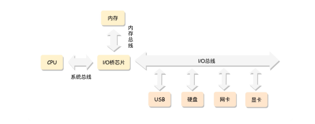

## 系统初始化

### X86 架构

- 计算机工作模式

核心点有几个：

1. CPU （Central Processing Unit)：主要的工作单元，核心驱动力，实际发生计算的地方
2. 总线 (Bus)：提供高速通道，其实就是主板上的各种集成电路和线路，主要有系统总线、内存总线、IO总线、南北桥芯片等
3. 内存 (Memory): 保存 CPU 计算的中间结果，缓存临时数据，CPU 可以进行下一步计算
4. 其他IO设备 (Input and Output)：提供其他能力，连接在总线上，比如网络通信能力、键盘鼠标、显示器等

CPU和内存是完成计算任务的核心组件，如何配合工作？

CPU包括：运算单元、数据单元和控制单元。

有几个要点（更加细节的地方，放在以后了解，这里的目的是了解工作模式）：

1. 一段程序的二进制文件起初是在磁盘上的，当以进程的形式运行起来后，二进制文件被加载到内存放在了进程的代码段，同时进程里还有数据段，用来存放执行过程中产生的数据，当进程得到运行时，代码段里的二进制会被load到CPU中，其实这个二进制就是CPU能够操作的指令
2. 如果有多个进程，是如何区分的呢？CPU的控制单元做这个事情，在控制单元里有**指令起始地址寄存器**和**数据起始地址寄存器**，这个很重要，装载了哪个进程的起始地址就是在执行哪个进程，当然这里是可以切换的，这个就是进程切换，更换进程的上下文信息就是替换这里的寄存器里存储的信息
3. CPU和内存如何配合工作，结果如何写回内存？控制单元里有不同种类的寄存器，每种寄存器都用不同的用途，除了 2 中的寄存器，还有一个**指令指针寄存器(IP)**，这里存放了要执行的下一条指令的内存地址，指令分为两部分：做什么操作和操作哪些数据，做什么操作的部分会交给运算单元，操作哪些数据的部分交给数据单元，数据单元负责把数据从内存的数据段加载到数据寄存器中，最后运算单元就可以执行指令操作，然后把计算结果放回数据单元，然后会有专门的指令把数据写回内存。
4. 在这个过程中，内存和CPU之间的数据传输，靠的是总线，要明白总线分为两类：地址总线和数据总线，是分离的，地址总线负责指明要访问的数据在内存的地址；数据总线负责传输数据，把数据写回内存或者从内存中加载到CPU的数据单元；此外，总线的位数，对地址总线来讲是可以操作的地址范围，对数据总线来讲是一次可以加载的数据的最大位数

- 开放、标准、兼容的架构

有一段X86架构的发展历史。

8086 的原理

