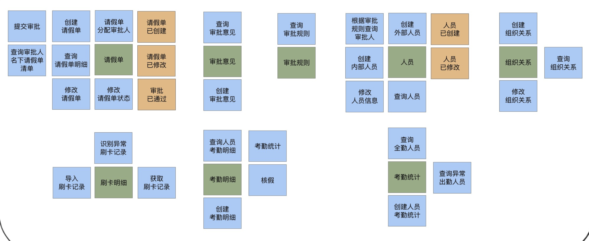

# 应用：在线请假考勤管理

### 功能需求

1. 请假人填写请假单提交审批，根据请假人身份、请假类型和请假天数进行校验，根据审批规则逐级递交上级审批，逐级核批通过则完成审批，否则审批不通过退回申请人。
2. 根据考勤规则，核销请假数据后，对考勤数据进行校验，输出考勤统计。

### 设计

#### 战略设计

战略设计一般是结合事件风暴进行的，会从：产品愿景，场景分析，领域建模和服务拆分等几个方面展开。

参与人员：领域专家、业务需求方、产品经理、架构师、项目经理、开发经理及相关开发、测试经理及相关测试。

针对当前系统，所有参与者运用事件风暴的方式，把所有可能的东西都提出来，并使用贴纸贴在白板上，另外还需要一个事件风暴的主持者，主持者要把讨论推进下去，对过于发散的讨论要即时收敛，对讨论的结论统一等 \(关于事件风暴如何实践，是一个偏重实操的东西，在不断试错中成长）


* 场景分析

项目团队成员一起用事件风暴分析请假和考勤的用户旅程。根据不同角色的旅程和场景分析，尽可能全面地梳理从前端操作到后端业务逻辑发生的所有操作、命令、领域事件以及外部依赖关系等信息，比如

```text
// 场景 1：请假
User: 请假人
1. 登录系统：获取请假人信息和权限数据，完成登录认证
2. 创建请假单：在请假单页面，选择请假类型和起始时间，录入请假信息，保存并创建请假单，提交审批
3. 修改请假单：查询请假单，修改请假单，提交请假审批
4. 提交审核：获取审批规则，根据规则，从人员组织关系中获取审批人，给请假单分配审批人

// 场景 2: 审批
User: 审批人
1. 登录系统: 获取审批人信息和权限数据，完成登录认证
2. 获取请假单: 获取审批人的所有待审批的请假单，选择某个请假单
3. 审批: 填写审批意见
4. 逐级审批: 如果需要上级审批，根据审批规则，从人员组织关系中获取审批人，给请假单分配审批人，重复以上的步骤
5. 最后审批人完成审批
```

经过分析后


* 领域建模

领域建模是通过对业务和问题域进行分析，建立领域模型。向上通过限界上下文指导微服务边界设计，向下通过聚合指导实体对象设计。

建模是一个不断收敛的过程：

1. 找出领域实体和值对象等领域对象

分析并找出发起或产生这些命令或领域事件的实体和值对象，将与实体或值对象有关的命令和事件聚集到实体。



2. 找出聚合根，根据实体、值对象与聚合根的依赖关系，建立聚合

定义聚合前，先找出聚合根。从上面的实体中，我们可以找出“请假单”和“人员”两个聚合根。然后找出与聚合根紧密依赖的实体和值对象。我们发现审批意见、审批规则和请假单紧密关联，组织关系和人员紧密关联。

3. 根据业务及语义边界等因素，定义界限上下文

由于人员组织关系聚合与请假聚合，共同完成请假的业务功能，两者在请假的限界上下文内。考勤聚合则单独构成考勤统计限界上下文。因此我们为业务划分请假和考勤统计两个限界上下文，建立请假和考勤两个领域模型。

* 微服务拆分

理论上一个限界上下文就可以设计为一个微服务，但还需要综合考虑多种外部因素，比如：职责单一性、敏态与稳态业务分离、非功能性需求（如弹性伸缩、版本发布频率和安全等要求）、软件包大小、团队沟通效率和技术异构等非业务要素。

#### 战术设计

战术设计是根据领域模型进行微服务设计的过程。这个阶段主要梳理微服务内的领域对象，梳理领域对象之间的关系，确定它们在代码模型和分层架构中的位置，建立领域模型与微服务模型的映射关系，以及服务之间的依赖关系。

* 分析微服务领域对象

我们分析微服务内应该有哪些服务？服务的分层？应用服务由哪些服务组合和编排完成？领域服务包括哪些实体和实体方法？哪个实体是聚合根？实体有哪些属性和方法？哪些对象应该设计为值对象等。

```text
// 1. 事件风暴的命令是外部的一些操作和业务行为，也是微服务对外提供的能力。
//    它往往与微服务的应用服务或者领域服务对应。我们可以将命令作为服务识别和设计的起点。
- 根据命令设计应用服务，确定应用服务的功能，服务集合，组合和编排方式。服务集合中的
  服务包括领域服务或其它微服务的应用服务。
  
- 根据应用服务功能要求设计领域服务，定义领域服务。这里需要注意：
  应用服务可能是由多个聚合的领域服务组合而成的。
  
- 根据领域服务的功能，确定领域服务内的实体以及功能

- 设计实体基本属性和方法

- 还要考虑领域事件的异步化处理

// 2. 聚合中的对象
// 3. 微服务内的对象清单
```


* 设计代码结构


